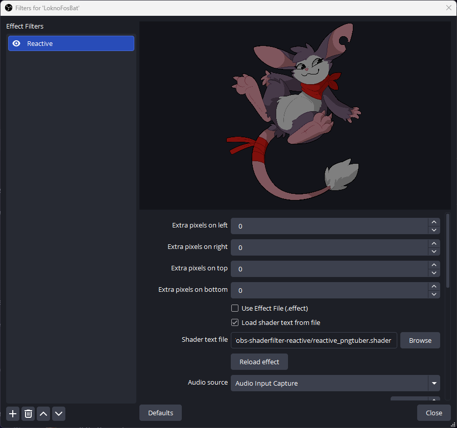

# obs-shaderfilter-reactive
Creates a PNGTuber on an image source in OBS Studio using obs-shaderfilter

## Features
- fades brightness with audio (adjustable)
- swap to talk texture (optional)
- swap to blink texture an interval (optional)
- squishes with volume (optional)

## How to use
- Install obs-shaderfilter 2.6.0+ (https://github.com/exeldro/obs-shaderfilter/releases)
- Download this entire git repo or just the file named `reactive_pngtuber.shader`
- Add a source to your scene to serve as the idle state
- Right-click source and select "Filters"
- Click the plus sign (+) and select "User-defined shader" (requires obs-shaderfilter)
- You may rename the shader/filter to whatever you like
- With your new filter selected, you should see some options below a preview of your source
- Check the box labeled "Load shader text from file"
- Click the button labeled "Browse" beside the box labeled "Shader text file"
- In your file system, select the file `reactive_pngtuber.shader`
- Select the dropdown labeled "Audio source" and select the audio input you wish to detect
- Basic set-up complete!

## Options

Audio source - Source of the audio you wish the shader to react to

Activation Threshold - The percentage of audio magnitude the image will begin to brighten

Full Activation Threshold - The percentage of the audio magnitude to image will be at full brightness

Inactive Minimum Intensity - The intensity (brightness) of the image when unactive

Swap to Talk Texture (Checkbox) - Whether to swap to a talk texture (image or OBS source) when activated

Blink? (Checkbox) - Whether to swap to a blink texture (image or OBS source) on a blink interval

Blink Frequency - How often the blink texture will appear (in seconds)

Blink Duration - How long the blink texture will appear per interval

Squish? (Checkbox) - Whether to squish the image with proportional to the audio magnitude

blink texture - obs source or image file to use for the blink texture

talk texture - obs source or image file to user for the talk texture

## Free to Use

Please credit me and if possible link back to the github.

## Future Features
- Add Scream Source
